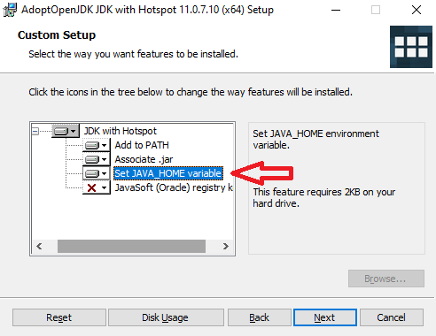
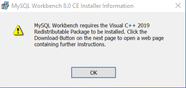

<!-- Improved compatibility of back to top link: See: https://github.com/othneildrew/Best-README-Template/pull/73 -->
<a name="readme-top"></a>

<!-- PROJECT SHIELDS -->
<!--
*** I'm using markdown "reference style" links for readability.
*** Reference links are enclosed in brackets [ ] instead of parentheses ( ).
*** See the bottom of this document for the declaration of the reference variables
*** for contributors-url, forks-url, etc. This is an optional, concise syntax you may use.
*** https://www.markdownguide.org/basic-syntax/#reference-style-links
-->
[![Contributors][contributors-shield]][contributors-url]
[![Stargazers][stars-shield]][stars-url]
[![Issues][issues-shield]][issues-url]
[![MIT License][license-shield]][license-url]


<!-- PROJECT LOGO -->
<br />
<div align="center">
  <a href="https://github.com/richzarate1997/recipe_routers">
    
  </a>

<h3 align="center">GetYum</h3>

  <p align="center">
    GetYum is a recipe-to-shopping list web application that relies on multiple APIs, a React UI, and Java with MySQL server and database. User accounts are able to create, read, update & delete recipes from our database. They can also interact with their own curated list of favorite recipes. The secondary functionality of the app allows users to interact with a grocery list feature that correlates with the recipes they may be planning to cook by adding, reading, updating and deleting ingredients from their main or independent lists. GetYum includes integration with Spotify so users can log in and stream while they interact with the application.
    <br />
    <a href="https://github.com/richzarate1997/recipe_routers"><strong>Explore the docs »</strong></a>
    <br />
    <br />
    <!-- <a href="https://github.com/richzarate1997/recipe_routers">View Demo</a>
    · -->
    <a href="https://github.com/richzarate1997/recipe_routers/issues">Report Bug</a>
    ·
    <a href="https://github.com/richzarate1997/recipe_routers/issues">Request Feature</a>
  </p>
</div>


<!-- TABLE OF CONTENTS -->
<details>
  <summary>Table of Contents</summary>
  <ol>
    <li>
      <a href="#about-the-project">About The Project</a>
      <ul>
        <li><a href="#built-with">Built With</a></li>
      </ul>
    </li>
    <li>
      <a href="#getting-started">Getting Started</a>
      <ul>
        <li><a href="#prerequisites">Prerequisites</a></li>
        <li><a href="#installation">Installation</a></li>
      </ul>
    </li>
    <li><a href="#usage">Usage</a></li>
    <li><a href="#roadmap">Roadmap</a></li>
    <li><a href="#contributing">Contributing</a></li>
    <li><a href="#license">License</a></li>
    <li><a href="#contact">Contact</a></li>
    <li><a href="#acknowledgments">Acknowledgments</a></li>
  </ol>
</details>


<!-- ABOUT THE PROJECT -->
## About The Project
<div align='center'>

[![GetYum Screen Shot][product-screenshot]](https://example.com)
</div>

GetYum is a recipe-to-shopping list application that is built on Spoonacular API, Spotify Web API, a React UI, and Java with MySQL server and database, built by our team, React Routers. The goal of GetYum is to create an all-in-one space for browsing, creating, and saving recipes such that you have somewhere to directly create a grocery list that has all the items you need to make your recipes. With GetYum, you'll no longer have to make multiple trips to the grocery store to pick up that one ingredient you missed for your favorite recipe. The Recipe Routers are a team made from members of Dev10's cohort 55. The members of Recipe Routers come from different backgrounds and partook in a fast paced full stack Java training; GetYum is our final capstone for this program.

We continue to build GetYum in an effort to broaden our skillsets and experience as software developers.

<p align="right">(<a href="#readme-top">back to top</a>)</p>


### Built With

* [![React][React.js]][React-url]
* [![React Router][React Router]][React Router-url]
* [![MUI][MaterialUI]][MUI-url]
* [![Spotify][Spotify]][Spotify-url]
* [![JWT][JWT]][JWT-url]
* [![Java][Java]][Java-url]
* [![Spring][Spring]][Spring-url]
* [![MySQL][MySQL]][MySQL-url]

<p align="right">(<a href="#readme-top">back to top</a>)</p>


<!-- GETTING STARTED -->
## Getting Started

To get a local copy up and running follow these steps. You will need Java 17 (LTS) installed to run the backend.
We recommend using IntelliJ IDEA as your IDE for all Java code and will provide instructions accordingly.


### Prerequisites

#### 1. Determine if there's already a JDK installed
Open a terminal program.
Type the following command:
  ```sh
  > javac --version
  ```

**Windows & Linux**
If the response is similar to,
```sh
javac: command not found
```
then move to Step 3.

**Mac**
Mac OS will proactively ask to install a jdk if it is missing. Click OK and proceed to the Step 3.

**All Platforms**
If `javac --version` responds with a version number less than 17, move to Step 2. If you're worried about your existing JDK and want to start fresh, move to Step 2.

#### 2. Uninstalling an existing JDK
**Windows**
Search for "Add or remove programs" or navigate to *Settings -> Apps*. Find the JDK in the application list. It could be the Oracle JDK or OpenJDK. Select the application and click *Uninstall*.

**Mac**
On Mac, we need admin priveleges and the terminal.

Locate the JDK in */Library/Java/JavaVirtualMachines/jdk[major-version].[minor-version].[release].jdk*

Browse to the location in the terminal and execute the `rm` command as admin (add `sudo`).
```sh
> sudo rm -rf jdk1.8.0_06.jdk
```
*Change the command to match the JDK file name exactly.

Move to Step 3.

#### 3. Install OpenJDK
Browse to [https://adoptium.net/](https://adoptium.net/).

Download the installer for your platform. Confirm that the version is Java 17 (LTS).

Run the installer.

If you're given the opportunity to set the JAVA_HOME variable, do so.
<div align=center>


</div>
After the installation is complete, close all terminal windows. Open a fresh terminal and check the javac version.
```sh
> javac --version
javac 17.0.6
```
If `javac` is still not found, the problem is likely that the JDK was not added to the PATH environment variable.

By default, the Adoptium OpenJDK install is located at:

Windows: `C:\Program Files\Eclipse Adoptium\jdk-17.[version-details]-hotspot`
Mac: `/Library/Java/JavaVirtualMachines/jdk[major-version].[minor-version].[release].jdk`

If you already have IntelliJ IDEA installed or are confident using another IDE to run the API, continue to Step 5.

#### 4. Install IntelliJ IDEA Community Edition
Visit [https://www.jetbrains.com/idea/download](https://www.jetbrains.com/idea/download) and download the IntelliJ Community Edition installer for your platform.

As you step through the installer, use default options. Options can be further configured after installation if desired.

#### 5. Update Node Package Manager
To run the react web client, make sure the node package manager is up to date:
* npm
  ```sh
  npm install npm@latest -g
  ```

#### 3. Install Docker Desktop for MySQL Container
We install MySQL as a Docker container which gives us the ability to easily add and remove entire MySQL DBMS instances. The [mysql image](https://hub.docker.com/_/mysql) is officially supported by the MySQL team. Alternatively, you can install MySQL Community Edition from [https://www.mysql.com/products/community/](https://www.mysql.com/products/community/) onto your local machine and skip to [Installation](#installation).

Docker Desktop installation is platform-specific.

**Mac**

[https://docs.docker.com/docker-for-mac/install/](https://docs.docker.com/docker-for-mac/install/)

If you don't already have Docker installed, use the default installation options.

**Windows**

[https://docs.docker.com/desktop/install/windows-install/](https://docs.docker.com/desktop/install/windows-install/)
The installation instructions mention it, but it's worth mentioning again: The Docker Desktop installation for Windows Home has a hard dependency on WSL 2(Windows Subsystem for Linux). WSL 2 enables us to run Linux virtual machines on Windows.

Ensure that WSL 2 is enabled with the following instructions: [https://docs.microsoft.com/en-us/windows/wsl/install-win10](https://docs.microsoft.com/en-us/windows/wsl/install-win10).

Run the Docker Desktop installer.

When prompted, Enable WSL 2 Features must be selected.

When prompted to choose between Windows containers and Linux containers, choose Linux. Otherwise, use default installation options. If you forget, no worries. The container runtime can be easily changed after install.

***Confirm***
Open a terminal. Check the `docker` command version.
```sh
> docker --version
Docker version 24.0.2, build cb74dfc
```
You should see a Docker version number.

#### 4. Install MySQL As Docker Container
If you receive an error and the install appeared to be successful, try a full machine restart and try `docker --version` again. If the error persists, troubleshoot.

Open a terminal and use the shortcut command `docker run` to install a local MySQL image, create a container from the image, and start the container.

To split the command into separate lines, each terminal requires a different line continuation character.

**PowerShell**
```sh
> docker run `
--name mysql-db `
-e MYSQL_ROOT_PASSWORD=your-password `
-p 3306:3306 `
-d `
mysql
```

**Bash**
```sh
> docker run \
--name mysql-db \
-e MYSQL_ROOT_PASSWORD=your-password \
-p 3306:3306 \
-d \
mysql
```

You'll notice docker working hard and reporting progress until the final result.
```sh
Unable to find image 'mysql:latest' locally
latest: Pulling from library/mysql
8559a31e96f4: Pull complete
d51ce1c2e575: Pull complete
c2344adc4858: Pull complete
fcf3ceff18fc: Pull complete
16da0c38dc5b: Pull complete
b905d1797e97: Pull complete
4b50d1c6b05c: Pull complete
571e8a282156: Pull complete
e7cc823c6090: Pull complete
61161ba7d2fc: Pull complete
74f29f825aaf: Pull complete
d29992fd199f: Pull complete
Digest: sha256:fe0a5b418ecf9b450d0e59062312b488d4d4ea98fc81427e3704f85154ee859c
Status: Downloaded newer image for mysql:latest
e4091976203fd32ff5275799c658ea2266ec8b8e7f6f54323ef9ad6c74d8df7c
```

Check your running containers.
```sh
> docker ps
CONTAINER ID        IMAGE               COMMAND                  CREATED             STATUS              PORTS                               NAMES
e4091976203f        mysql               "docker-entrypoint.s…"   2 minutes ago       Up 2 minutes        0.0.0.0:3306->3306/tcp, 33060/tcp   mysql-db
```
We now have a container running MySQL Community Edition with its default port exposed to our network. The next task is to connect to it.

#### 5. Install MySQL Workbench
Browse to [MySQL Workbench downloads](https://dev.mysql.com/downloads/workbench/). Be sure the operating system matches your laptop (or desktop?) operating system. We're installing Workbench directly on the machine, not via Docker.

After you click on the Download butto, it appears that you need an Oracle account to complete the download, but you don't. Just click the subtle link: No thanks, just start my download.

With the download complete, run the installer.
<details>
<summary>Windows Install Failure</summary>
The Windows install *may* fail because of missing prerequisites.


*Windows prereq failure*
If it does:
1. Exit the installer completely. Don't try to download from inside the installer.
2. Download the Visual C++ 2019 Redistrutable from [Microsoft: The latest supported Visual C++ downloads](https://support.microsoft.com/en-us/help/2977003/the-latest-supported-visual-c-downloads). Select the Visual C++ 2019 Redistributable installer for your computer's architecture.
3. Run the Visual C++ Redistributable installer.
4. When it's complete, re-run the MySQL Workbench Installer.
</details>


### Installation
1. Get a an API Key by subscribing to the spoonacular API at [https://rapidapi.com](https://rapidapi.com/spoonacular/api/recipe-food-nutrition/)
   * The free tier of this API is sufficient but requires a credit card on file in case you make more than the 50 requests daily. To avoid making too many requests the GetYum Java API caches requests from recipe searches, and the home page `Click Me` button is only enabled to run once per load of the home page. If you are concerned about making too many requests, you can watch your API consumption in the [RapidAPI Dashboard](https://rapidapi.com/developer/dashboard).
2. Clone the repo
   ```sh
   git clone https://github.com/richzarate1997/recipe_routers.git
   ```
3. Get a Spotify Client ID from [Spotify for Developers](https://developer.spotify.com/documentation/web-api) (*optional -- web player won't operate without this*)
   * If you have a Spotify Account, you can follow the steps [here](https://developer.spotify.com/documentation/web-api) to "create an app". Once you have created the app you will receive a Client ID.
   * In `<your_repository_path>/recipe_routers/clients/client-web` create a file called `.env` insert your Spotify Client ID:
   ```sh
   REACT_APP_SPOTIFY_CLIENT_ID=your-spotify-client-id
   ```
4. Connect to the MySQL Server with Workbench
   * Run MySQL Workbench. Workbench starts with a home view.
   * The home view may warn:
   *MySQL Workbench could not detect any MySQL server running. This means that MySQL is not installed or is not running.*
   * Don't worry about the warning. Workbench doesn't know about our MySQL Docker container. Click on the MySQL Connections *+* icon for a new connection.
   * Leave all defaults, but give the connection a name. We used the same name as our container, but you can name it anything you like. The names aren't linked in any way.
   * To confirm the connection works, click Test Connection. Enter your root password from the Docker container configuration. Then click OK.
   * A connection success dialog appears on success. Dismiss it and then click OK to complete the connection set up.
   * The Workbench home view now shows the learn-mysql connection.
   * Click on the connection. If asked to enter your password again, do so and click OK. Workbench switches to an active mode when it connects to a database.
5. Run DB Schema Script
   * Open up the SQL schema script by selecting *File->Open SQL Script...* and then selecting the schema at `<your_repository_path>/recipe_routers/agile_aprons/sql/schema.sql`.
   * You can run the script by clicking the lightning bolt icon (the one without the cursor on it). The Action Output should fill with several lines with corresponding green checkmarks. If you see any red *x* icons instead, run the script again.
6. Configure & Run the GetYum Server
   * In IntelliJ (or your preferred Java IDE) open the project from the `agile_aprons` directory that is nested inside the root of the recipe_routers repository: `<your_repository_path>/recipe_routers/agile_aprons`. Right-click the `App` file from the Project file tree and select `Modify Run Configuration...`. Here you need to add the following environment variables for it to run correctly:
   ```sh
   DB_USERNAME=root;DB_PASSWORD=your-password;DB_URL=jdbc:mysql://localhost:3306/recipe_list;API_KEY=your-API-key
   ```
   * Click `Apply` and `Close`, then right-click on `App` again and select `Run 'App'` to start the server.
7. Install NPM packages
   From the root directory of the repository:
   ```sh
   cd clients/client-web
   npm install
   ```
8. Run the React Web Client
   ```sh
   npm start
   ```
Now you should have the whole application available and running from the react client at `http://localhost:3000`.

<p align="right">(<a href="#readme-top">back to top</a>)</p>


<!-- USAGE EXAMPLES -->
## Usage

<!-- Use this space to show useful examples of how a project can be used. Additional screenshots, code examples and demos work well in this space. You may also link to more resources. -->

<!-- Dragged < 10mb video files into github browser editor to display videos on Github -->
https://github.com/richzarate1997/recipe_routers/assets/104476731/1910a33e-8e18-4916-bbad-0e77d77adcb0
https://github.com/richzarate1997/recipe_routers/assets/104476731/5fdd4ce0-763e-47f8-914d-fc2d8d5b4ab3
https://github.com/richzarate1997/recipe_routers/assets/104476731/8db2460d-7dd2-42d7-837b-53c7c3a51909

<!-- _For examples, please refer to the [Documentation](https://example.com)_ -->

<p align="right">(<a href="#readme-top">back to top</a>)</p>


<!-- ROADMAP -->
## Roadmap

- [x] Java API with full CRUD functionality for Recipes
  - [x] Conditionally rendered validation messages for recipe creation & user login/registration
- [x] Access to additional recipes through Spoonacular API
  - [x] Response caching to eliminate redundant requests
  - [x] Conditional data scraping of unfamiliar recipes
- [x] Recipe search bar that yields blended results from user-created recipes & spoonacular
- [x] In Browser Audio with Spotify Web Player Integration
- [x] Secure login/registration of user accounts with JSON Web Token & Spring Security
- [x] User recipes, favorite recipes, and grocery list persistence
- [x] Responsive React Web UI utilizing Material UI component library
  - [x] Conditional Routing based on user account permissions
- [ ] Seamless recipe-to-grocery-list option that adds a recipe's ingredients to a user's grocery list.
- [ ] Recipe ingredient measurement conversion based on user preference (Metric / Imperial)
- [ ] Advanced search and filtering of recipe results
- [ ] Pagination for robust recipe search results
- [ ] React Native Mobile UI

See the [open issues](https://github.com/richzarate1997/recipe_routers/issues) for a full list of proposed features (and known issues).

<p align="right">(<a href="#readme-top">back to top</a>)</p>


<!-- CONTRIBUTING -->
## Contributing

Contributions are what make the open source community such an amazing place to learn, inspire, and create. Any contributions you make are **greatly appreciated**.

If you have a suggestion that would make this better, please fork the repo and create a pull request. You can also simply open an issue with the tag "enhancement".
Don't forget to give the project a star! Thanks again!

1. Fork the Project
2. Create your Feature Branch (`git checkout -b feature/AmazingFeature`)
3. Commit your Changes (`git commit -m 'Add some AmazingFeature'`)
4. Push to the Branch (`git push origin feature/AmazingFeature`)
5. Open a Pull Request

<p align="right">(<a href="#readme-top">back to top</a>)</p>


<!-- LICENSE -->
## License

Distributed under the MIT License. See `LICENSE.txt` for more information.

<p align="right">(<a href="#readme-top">back to top</a>)</p>


<!-- CONTACT -->
## Contact

<!-- Your Name - email@email_client.com -->
Alice Wu - awu@dev-10.com
Coren "Kern" Frankel - cfrankel@dev-10.com
Richard Zarate - rzarate@dev-10.com

Project Link: [https://github.com/richzarate1997/recipe_routers](https://github.com/richzarate1997/recipe_routers)

<p align="right">(<a href="#readme-top">back to top</a>)</p>


<!-- ACKNOWLEDGMENTS -->
## Acknowledgments

* [Brendan Kendrick](https://github.com/oneowhat) - Dev10 Instructor
* [Dev10](https://www.dev-10.com)
* [README Template](https://github.com/othneildrew/Best-README-Template)
* [Img Shields](https://shields.io)
* [React Spinners](https://www.davidhu.io/react-spinners/)


<p align="right">(<a href="#readme-top">back to top</a>)</p>


<!-- MARKDOWN LINKS & IMAGES -->
<!-- https://www.markdownguide.org/basic-syntax/#reference-style-links -->
[contributors-shield]: https://img.shields.io/github/contributors/richzarate1997/recipe_routers.svg?style=for-the-badge
[contributors-url]: https://github.com/richzarate1997/recipe_routers/graphs/contributors
[stars-shield]: https://img.shields.io/github/stars/richzarate1997/recipe_routers.svg?style=for-the-badge
[stars-url]: https://github.com/richzarate1997/recipe_routers/stargazers
[issues-shield]: https://img.shields.io/github/issues/richzarate1997/recipe_routers.svg?style=for-the-badge
[issues-url]: https://github.com/richzarate1997/recipe_routers/issues
[license-shield]: https://img.shields.io/github/license/richzarate1997/recipe_routers.svg?style=for-the-badge
[license-url]: https://github.com/richzarate1997/recipe_routers/blob/main/LICENSE.txt
[product-screenshot]: images/getyum_landing_page.png
[React.js]: https://img.shields.io/badge/React-20232A?style=plastic&logo=react&logoColor=61DAFB
[React-url]: https://reactjs.org/
[React Router]: https://img.shields.io/badge/React_Router-CA4245?style=plastic&logo=react-router&logoColor=white
[React Router-url]: https://reactrouter.com/
[MaterialUI]: https://img.shields.io/badge/MUI-%230081CB.svg?style=plastic&logo=mui&logoColor=white
[MUI-url]: https://mui.com
[Spotify]: https://img.shields.io/badge/Spotify-1ED760?style=plastic&logo=spotify&logoColor=white
[Spotify-url]: https://developer.spotify.com
[JWT]: https://img.shields.io/badge/JWT-black?style=plastic&logo=JSON%20web%20tokens
[JWT-url]: https://jwt.io
[Java]: https://img.shields.io/badge/Java-%23ED8B00.svg?style=plastic&logo=openjdk&logoColor=white
[Java-url]: https://openjdk.org
[Spring]: https://img.shields.io/badge/Spring-%236DB33F.svg?style=plastic&logo=spring&logoColor=white
[Spring-url]: https://spring.io
[MySQL]: https://img.shields.io/badge/MySQL-%2300f.svg?style=plastic&logo=mysql&logoColor=white
[MySQL-url]: https://www.mysql.com
