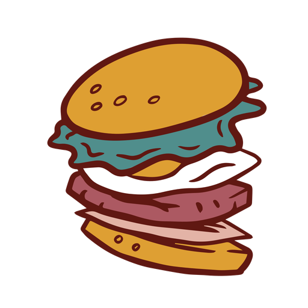

<!-- Improved compatibility of back to top link: See: https://github.com/othneildrew/Best-README-Template/pull/73 -->
<a name="readme-top"></a>

<!-- PROJECT SHIELDS -->
<!--
*** I'm using markdown "reference style" links for readability.
*** Reference links are enclosed in brackets [ ] instead of parentheses ( ).
*** See the bottom of this document for the declaration of the reference variables
*** for contributors-url, forks-url, etc. This is an optional, concise syntax you may use.
*** https://www.markdownguide.org/basic-syntax/#reference-style-links
-->
[![Contributors][contributors-shield]][contributors-url]
[![Stargazers][stars-shield]][stars-url]
[![Issues][issues-shield]][issues-url]
[![MIT License][license-shield]][license-url]


<!-- PROJECT LOGO -->
<br />
<div align="center">
  <a href="https://github.com/richzarate1997/recipe_routers">
    
  </a>

<h3 align="center">GetYum</h3>

  <p align="center">
    GetYum is a recipe-to-shopping list web application that relies on multiple APIs, a React UI, and Java with MySQL server and database. User accounts are able to create, read, update & delete recipes from our database. They can also interact with their own curated list of favorite recipes. The secondary functionality of the app allows users to interact with a grocery list feature that correlates with the recipes they may be planning to cook by adding, reading, updating and deleting ingredients from their main or independent lists. GetYum includes integration with Spotify so users can log in and stream while they interact with the application.
    <br />
    <a href="https://github.com/richzarate1997/recipe_routers"><strong>Explore the docs »</strong></a>
    <br />
    <br />
    <!-- <a href="https://github.com/richzarate1997/recipe_routers">View Demo</a>
    · -->
    <a href="https://github.com/richzarate1997/recipe_routers/issues">Report Bug</a>
    ·
    <a href="https://github.com/richzarate1997/recipe_routers/issues">Request Feature</a>
  </p>
</div>


<!-- TABLE OF CONTENTS -->
<details>
  <summary>Table of Contents</summary>
  <ol>
    <li>
      <a href="#about-the-project">About The Project</a>
      <ul>
        <li><a href="#built-with">Built With</a></li>
      </ul>
    </li>
    <li>
      <a href="#getting-started">Getting Started</a>
      <ul>
        <li><a href="#prerequisites">Prerequisites</a></li>
        <li><a href="#installation">Installation</a></li>
      </ul>
    </li>
    <li><a href="#usage">Usage</a></li>
    <li><a href="#roadmap">Roadmap</a></li>
    <li><a href="#contributing">Contributing</a></li>
    <li><a href="#license">License</a></li>
    <li><a href="#contact">Contact</a></li>
    <li><a href="#acknowledgments">Acknowledgments</a></li>
  </ol>
</details>


<!-- ABOUT THE PROJECT -->
## About The Project
<div align='center'>

[![GetYum Screen Shot][product-screenshot]](https://example.com)
</div>

GetYum is a recipe-to-shopping list application that is built on Spoonacular API, Spotify Web API, a React UI, and Java with MySQL server and database, built by our team, React Routers. The goal of GetYum is to create an all-in-one space for browsing, creating, and saving recipes such that you have somewhere to directly create a grocery list that has all the items you need to make your recipes. With GetYum, you'll no longer have to make multiple trips to the grocery store to pick up that one ingredient you missed for your favorite recipe. The Recipe Routers are a team made from members of Dev10's cohort 55. The members of Recipe Routers come from different backgrounds and partook in a fast paced full stack Java training; GetYum is our final capstone for this program.

We continue to build GetYum in an effort to broaden our skillsets and experience as software developers.

<p align="right">(<a href="#readme-top">back to top</a>)</p>


### Built With

* [![React][React.js]][React-url]
* [![React Router][React Router]][React Router-url]
* [![MUI][MaterialUI]][MUI-url]
* [![Spotify][Spotify]][Spotify-url]
* [![JWT][JWT]][JWT-url]
* [![Java][Java]][Java-url]
* [![Spring][Spring]][Spring-url]
* [![MySQL][MySQL]][MySQL-url]

<p align="right">(<a href="#readme-top">back to top</a>)</p>


<!-- GETTING STARTED -->
## Getting Started

This is an example of how you may give instructions on setting up your project locally.
To get a local copy up and running follow these simple example steps.

### Prerequisites

This is an example of how to list things you need to use the software and how to install them.
* npm
  ```sh
  npm install npm@latest -g
  ```

### Installation
<!-- Incomplete -->
1. Get a an API Key by subscribing to spoonacular API at [https://rapidapi.com](https://rapidapi.com/spoonacular/api/recipe-food-nutrition/)
2. Clone the repo
   ```sh
   git clone https://github.com/richzarate1997/recipe_routers.git
   ```
3. Install NPM packages
   ```sh
   cd clients/client-web
   npm install
   ```
4. Enter your API in `config.js`
   ```js
   const API_KEY = 'ENTER YOUR API';
   ```

<p align="right">(<a href="#readme-top">back to top</a>)</p>


<!-- USAGE EXAMPLES -->
## Usage

Use this space to show useful examples of how a project can be used. Additional screenshots, code examples and demos work well in this space. You may also link to more resources.

_For more examples, please refer to the [Documentation](https://example.com)_

<p align="right">(<a href="#readme-top">back to top</a>)</p>


<!-- ROADMAP -->
## Roadmap

- [ ] Feature 1
- [ ] Feature 2
- [ ] Feature 3
    - [ ] Nested Feature

See the [open issues](https://github.com/richzarate1997/recipe_routers/issues) for a full list of proposed features (and known issues).

<p align="right">(<a href="#readme-top">back to top</a>)</p>


<!-- CONTRIBUTING -->
## Contributing

Contributions are what make the open source community such an amazing place to learn, inspire, and create. Any contributions you make are **greatly appreciated**.

If you have a suggestion that would make this better, please fork the repo and create a pull request. You can also simply open an issue with the tag "enhancement".
Don't forget to give the project a star! Thanks again!

1. Fork the Project
2. Create your Feature Branch (`git checkout -b feature/AmazingFeature`)
3. Commit your Changes (`git commit -m 'Add some AmazingFeature'`)
4. Push to the Branch (`git push origin feature/AmazingFeature`)
5. Open a Pull Request

<p align="right">(<a href="#readme-top">back to top</a>)</p>


<!-- LICENSE -->
## License

Distributed under the MIT License. See `LICENSE.txt` for more information.

<p align="right">(<a href="#readme-top">back to top</a>)</p>


<!-- CONTACT -->
## Contact

<!-- Your Name - email@email_client.com -->
Alice Wu - awu@dev-10.com
Coren "Kern" Frankel - cfrankel@dev-10.com
Richard Zarate - rzarate@dev-10.com

Project Link: [https://github.com/richzarate1997/recipe_routers](https://github.com/richzarate1997/recipe_routers)

<p align="right">(<a href="#readme-top">back to top</a>)</p>


<!-- ACKNOWLEDGMENTS -->
## Acknowledgments

* [README Template](https://github.com/othneildrew/Best-README-Template)
* [Img Shields](https://shields.io)
* Brendan Kendrick - Dev10 Instructor
<!-- * []() -->

<p align="right">(<a href="#readme-top">back to top</a>)</p>


<!-- MARKDOWN LINKS & IMAGES -->
<!-- https://www.markdownguide.org/basic-syntax/#reference-style-links -->
[contributors-shield]: https://img.shields.io/github/contributors/richzarate1997/recipe_routers.svg?style=for-the-badge
[contributors-url]: https://github.com/richzarate1997/recipe_routers/graphs/contributors
[stars-shield]: https://img.shields.io/github/stars/richzarate1997/recipe_routers.svg?style=for-the-badge
[stars-url]: https://github.com/richzarate1997/recipe_routers/stargazers
[issues-shield]: https://img.shields.io/github/issues/richzarate1997/recipe_routers.svg?style=for-the-badge
[issues-url]: https://github.com/richzarate1997/recipe_routers/issues
[license-shield]: https://img.shields.io/github/license/richzarate1997/recipe_routers.svg?style=for-the-badge
[license-url]: https://github.com/richzarate1997/recipe_routers/blob/main/LICENSE.txt
[product-screenshot]: images/getyum_landing_page.png
[React.js]: https://img.shields.io/badge/React-20232A?style=for-the-badge&logo=react&logoColor=61DAFB
[React-url]: https://reactjs.org/
[React Router]: https://img.shields.io/badge/React_Router-CA4245?style=for-the-badge&logo=react-router&logoColor=white
[React Router-url]: https://reactrouter.com/
[MaterialUI]: https://img.shields.io/badge/MUI-%230081CB.svg?style=for-the-badge&logo=mui&logoColor=white
[MUI-url]: https://mui.com
[Spotify]: https://img.shields.io/badge/Spotify-1ED760?style=for-the-badge&logo=spotify&logoColor=white
[Spotify-url]: https://developer.spotify.com
[JWT]: https://img.shields.io/badge/JWT-black?style=for-the-badge&logo=JSON%20web%20tokens
[JWT-url]: https://jwt.io
[Java]: https://img.shields.io/badge/java-%23ED8B00.svg?style=for-the-badge&logo=openjdk&logoColor=white
[Java-url]: https://openjdk.org
[Spring]: https://img.shields.io/badge/spring-%236DB33F.svg?style=for-the-badge&logo=spring&logoColor=white
[Spring-url]: https://spring.io
[MySQL]: https://img.shields.io/badge/mysql-%2300f.svg?style=for-the-badge&logo=mysql&logoColor=white
[MySQL-url]: https://www.mysql.com